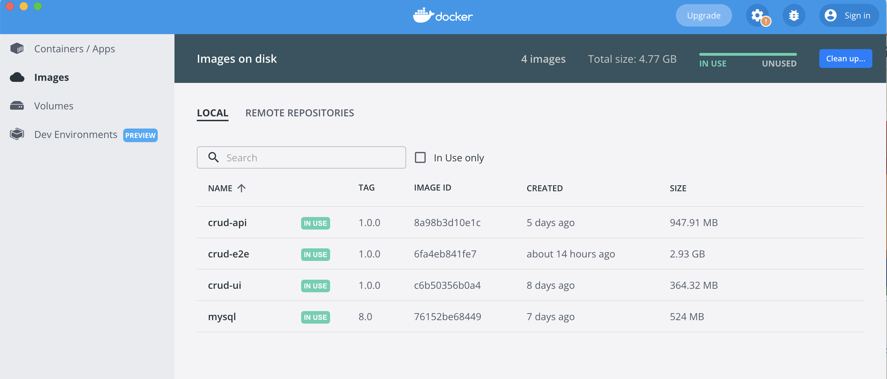
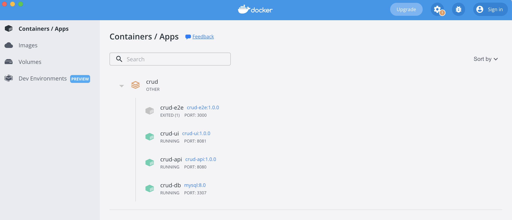
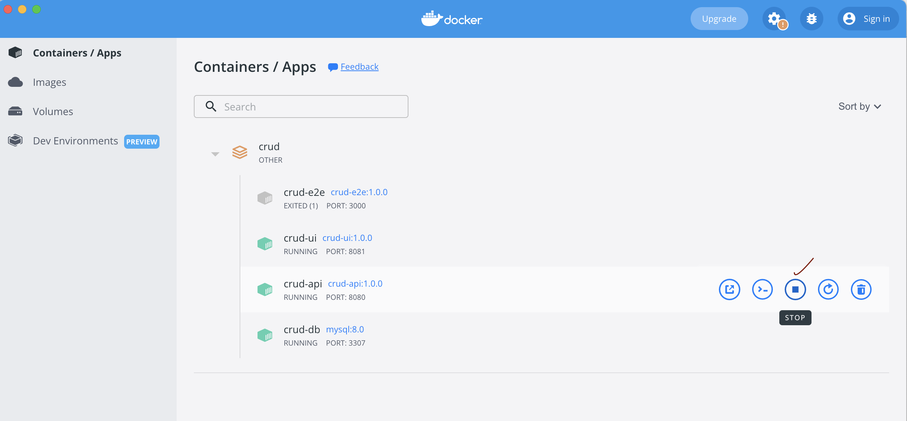
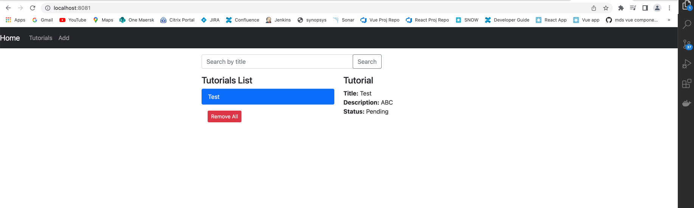
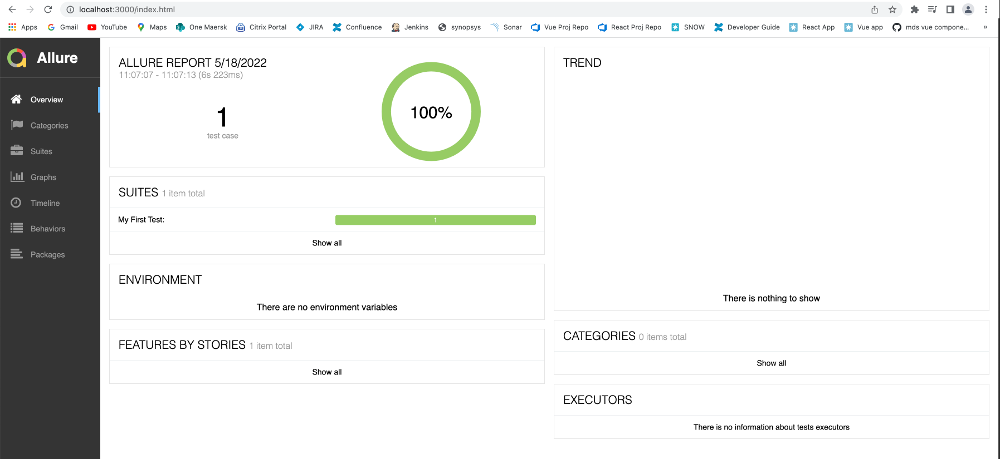

# docker-full-stack-e2e

Simple example to dockerize a full stack aplication including e2e tests.

Tech stack used

1. Database - MySQL
2. Backend API - Nodejs + express
3. Frontend - Vuejs
4. End to end tests - CodeceptJs

## How to run the application locally?

* Install docker. Follow this link for installation [Link](https://docs.docker.com/engine/install/)
* Run command ```docker-compose build``` in the root folder containing docker-compose.yml
* This will create following images (you can check the images by running docker commands in cli or open docker dashboard)


* Run command ```docker-compose up```

* This will startup the container


* The app will startup. But, there might be a problem with the API.

* The API startsup before the MySQL database which results in connection exception.

* To fix that stop the API instance in docker dashboard and start it again (Make sure DB is up and running)


* Open http://localhost:8081/ and perform some crud operations (Like create tutorial, delete turorial)


* You can also check the e2e test report by launching the url http://localhost:3000/


<br/>

## Note 
* If you do not like allure report (Since it requires installation of Java in container, which ends up taking some extra time for installation) - Then please remove this line in DockerFile of e2e 
```RUN apt-get update && apt-get -y install default-jre```
* Also remove command which is responsible for running report
```npx allure serve testReports/allure-reports --port 3000```
